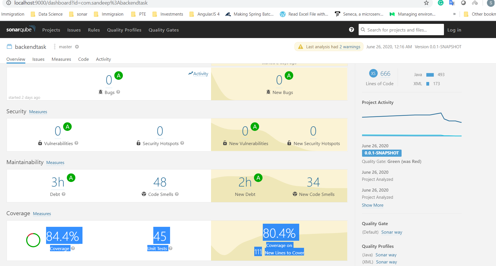
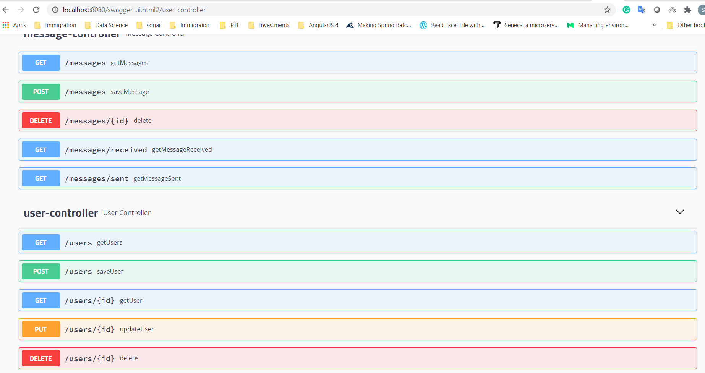
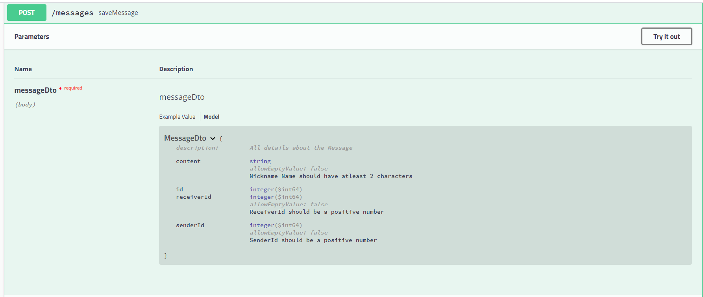
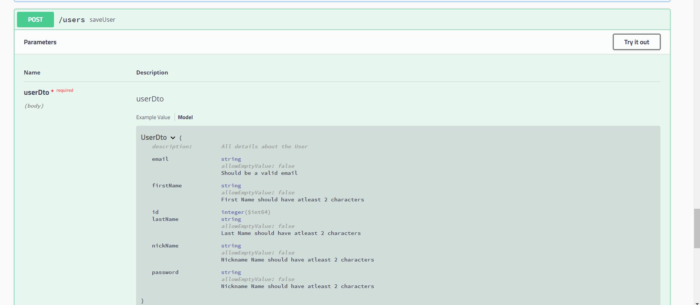
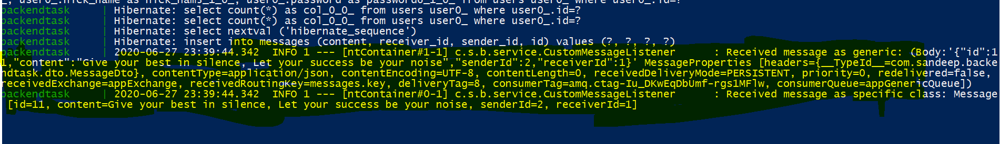

Backend developer task  is developed using below technical stack

Java 8, 
Spring Boot, 
Postgressql, 
RabbitMq (for sending message over the queue)
Sonar, 
Swagger 
and actuators.

### Below are the features covered with the task ###

1. Application is developed using Spring boot 2.1 and restful design pattern with TDD approach, added unit, integration and controller mock tests. 

2. Input validations and error/exception handling.

3. Content negotiation for both json and xml.

4. Custom Swagger document for api's - http://localhost:8080/swagger-ui.html#. and actuators are added http://localhost:8080/actuator

5. Docker file added for building an image, tested locally to make sure 81 percentage of code coverage and all security issues and sonar bugs are cleared.

6. Docker 

### Steps for testing the application code coverage ###

1. Pull SonarQube into docker by using following command(7.9-community tag is important as latest image has some problem processing java 8 code and falls into loading loop so follow this specific command) - docker pull sonarqube:7.9-community

2. docker run -d --name sonarqube -p 9000:9000 -p 9092:9092 sonarqube:7.9-community

3. docker run -d -p 15672:15672 -p 5672:5672 --name rabbitmq-test rabbitmq:3-management ( messaging has dependency on the test cases)

This will start a docker container based on the sonarqube image and give it the name sonarqube. Adding the -d means the container will run in detached mode (background). The -p 9000:9000 and 9092:9092 means that we expose port 9000 and 9092 to the host using the same port numbers.

3. Run the following command " mvn clean install sonar:sonar " - it reports 84.4 % code coverage 

4. Access the Sonar code coverage using following link - http://localhost:9000/dashboard?id=com.sandeep%3Abackendtask, which is run against integration, unit and mvcmock tests.

### Below is the latest screenshot of code coverage of this assignment ###

### Application workflow testing ###
1. Run clean package -Dmaven.test.skip=true

2. Run the application by command "docker-compose up" this will download all dependent images(postgressql database, rabbitmq, sonarqube) in docker and  run the application. 

Spring boot actuator info on application 
http://localhost:8080/actuator/info 
http://localhost:8080/actuator/info

http://localhost:8080/swagger-ui.html

Sample API details with custom model object details 

Testing with postman rest calls 

### USER API testing ###

1. POST - http://localhost:8080/users/

Request body raw JSON-
 
	{
    "nickName": "sandy",
	"password": "sandy12345",
	"firstName": "Sandeep",
	"lastName": "Vedavyas",
	"email": "sandeep.vedavyas@test.com"
	}
Response - 201 Created success

2. POST - http://localhost:8080/users/
Request
	
	{
	    "nickName": "sandy",
		"password": "sandy12345",
		"firstName": "Sandeep",
		"lastName": "Vedavyas",
		"email": "sandeep.vedavyas@test.com"
		}
	
Response - 
	
	{"status": 409,
    "message": "NickName is already taken!,Please use different nickname"
	}

3. POST - http://localhost:8080/users/

Request body raw JSON-

	{
	"nickName": "sunayana",
	"password": "sandy12345",
	"firstName": "Sunayana",
	"lastName": "Sandeep",
	"email": "sunayana.sandeep@test.com"
	}
	
Response - 201 created success

4. POST - http://localhost:8080/users/
Request body raw JSON-

	{	
		"nickName": "sunayana1",
		"password": "sandy123456",
		"firstName": "Sunayana",
		"lastName": "Sandeep",
		"email": "sunayana.sandeep@test.com"
		}
Response - 201 created success

5. GET http://localhost:8080/users/

Response - 

	[
	    {
	        "id": 1,
	        "nickName": "sandy",
	        "password": "sandy12345",
	        "firstName": "Sandeep",
	        "lastName": "Vedavyas",
	        "email": "sandeep.vedavyas@test.com"
	    },
	    {
	        "id": 2,
	        "nickName": "sunayana",
	        "password": "sandy12345",
	        "firstName": "Sunayana",
	        "lastName": "Sandeep",
	        "email": "sunayana.sandeep@test.com"
	    },
	    {
	        "id": 3,
	        "nickName": "sunayana1",
	        "password": "sandy123456",
	        "firstName": "Sunayana",
	        "lastName": "Sandeep",
	        "email": "sunayana.sandeep@test.com"
	    }
	]

6. PUT - http://localhost:8080/users/2

Request - 

	{
    "nickName": "sunayana1123",
	"password": "sandy123456",
	"firstName": "Sunayana",
	"lastName": "Sandeep",
	"email": "sunayana.sandeep@test.com"
	}

Response - 
	
	{
    "id": 2,
    "nickName": "sunayana1123",
    "password": "sandy123456",
    "firstName": "Sunayana",
    "lastName": "Sandeep",
    "email": "sunayana.sandeep@test.com"
	}

7. DELETE - http://localhost:8080/users/3

	{
    "status": 200,
    "message": "User has been deleted successfully"
	}

8. try delete again DELETE - http://localhost:8080/users/3

	{
    "status": 404,
    "message": "Unable to delete. User not found with id::3"
	}

### MESSAGE API testing ###

1. GENERAL API CALL - GET http://localhost:8080/messages/

Response - 204 No Content as no messages sent between users

2. POST - http://localhost:8080/messages/

a. Request - 

	{
	"content": "Work hard in silence, Let your success be your noise",
	"senderId": 1,
	"receiverId": 2
	}
Below you can notice the generic and custom message object sent over the RabbitMq queue system and printed into console by listner.
  
Response - 201 Created 

b. Try sending message to yourself- http://localhost:8080/messages/

	{
	"content": "Let your success be your noise test again ",
	"senderId": 3,
	"receiverId": 3
  	}
  
  
  Response - 
  
	{
    "message": "Validation Failed",
    "errors": {
        "Message": "You cannot send message to yourself"
    },
    "meta": null
	}

c.  Invalid receiver user - http://localhost:8080/messages/ 

Request 

	{
	"content": "Let your success be your noise test again ",
	"senderId": 3,
	"receiverId": 10 // doesnt created and do not exist in system 
  	}
  
Response - 

	{
	    "status": 404,
	    "message": "No user exists with id :: 10, Please enter valid receiver id"
	}
  
  
3. Get all messages GET - http://localhost:8080/messages/

	[
	    {
	        "id": 4,
	        "content": "Work hard in silence, Let your success be your noise",
	        "senderId": 1,
	        "receiverId": 2
	    },
	    {
	        "id": 5,
	        "content": " Let your success be your noise",
	        "senderId": 1,
	        "receiverId": 2
	    },
	    {
	        "id": 6,
	        "content": " Let your success be your noise,hello",
	        "senderId": 1,
	        "receiverId": 2
	    },
	    {
	        "id": 7,
	        "content": "Work hard in silence, Let your success be your noise",
	        "senderId": 1,
	        "receiverId": 2
	    }
	]

4. All messages received by a specific user -  http://localhost:8080/messages/received?userId=2&senderId=1

	[
	    {
	        "id": 4,
	        "content": "Work hard in silence, Let your success be your noise",
	        "senderId": 1,
	        "receiverId": 2
	    },
	    {
	        "id": 5,
	        "content": "Work hard in silence, Let your success be your noise",
	        "senderId": 1,
	        "receiverId": 2
	    },
	    {
	        "id": 6,
	        "content": "Work hard in silence, Let your success be your noise",
	        "senderId": 1,
	        "receiverId": 2
	    },
	    {
	        "id": 7,
	        "content": "Work hard in silence, ",
	        "senderId": 1,
	        "receiverId": 2
	    },
	    {
	        "id": 8,
	        "content": "Let your success be your noise ",
	        "senderId": 1,
	        "receiverId": 2
	    }
	]

5. Get all messages which i have received - no specific sender - 

	[
	    {
	        "id": 4,
	        "content": "Work hard in silence, Let your success be your noise",
	        "senderId": 1,
	        "receiverId": 2
	    },
	    {
	        "id": 5,
	        "content": "Work hard in silence, Let your success be your noise",
	        "senderId": 1,
	        "receiverId": 2
	    },
	    {
	        "id": 6,
	        "content": "Work hard in silence, Let your success be your noise",
	        "senderId": 1,
	        "receiverId": 2
	    },
		......
	    {
	        "id": 10,
	        "content": "Let your success be your noise test again ",
	        "senderId": 3,
	        "receiverId": 2
	    }
	]

6. GET all messages sent by a user  GET http://localhost:8080/messages/sent?userId=1

	[
	    {
	        "id": 4,
	        "content": "Work hard in silence, Let your success be your noise",
	        "senderId": 1,
	        "receiverId": 2
	    },
	    {
	        "id": 5,
	        "content": "Work hard in silence, Let your success be your noise",
	        "senderId": 1,
	        "receiverId": 2
	    },
	    {
	        "id": 6,
	        "content": "Work hard in silence, Let your success be your noise",
	        "senderId": 1,
	        "receiverId": 2
	    },
		.....
	    {
	        "id": 9,
	        "content": "Let your success be your noise ",
	        "senderId": 1,
	        "receiverId": 3
	    }
	]

### Below are possible potential improvements ### 
1. User security implementation using spring security
2. chat/conversation depending on user status based on session active/ inactive
3. Message to conversation Many to One mapping to keep chat history and auditing records. 
4. Extending message content to images, files etc. 
5. Moving to non relational database for scaling. 
